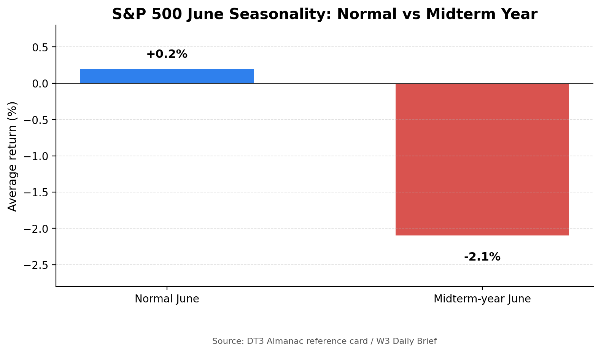
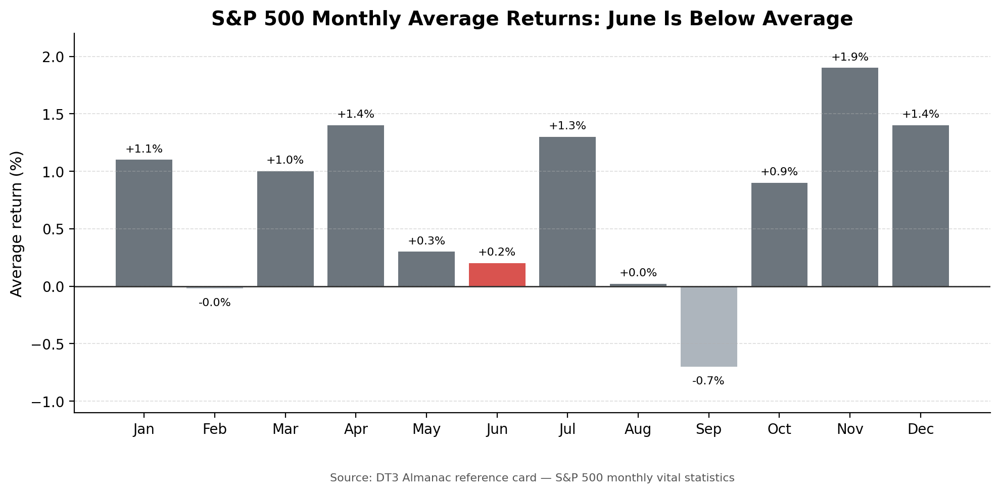
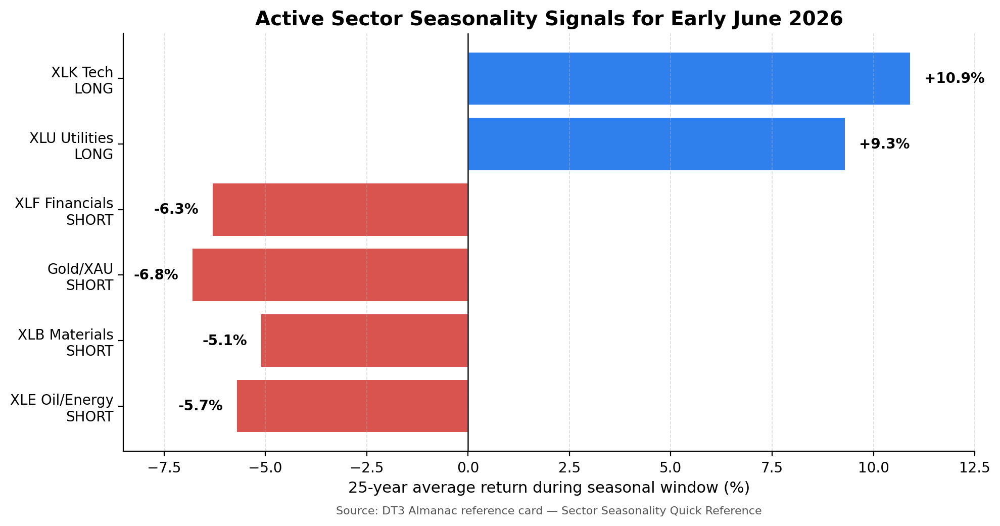

# Almanac Agent Output — R3 — Week 2

**Sprint:** Week 2  
**Market week:** 2–6 June 2026  
**Role:** R3 — Almanac Agent Lead  
**File:** `almanac.md`  
**Purpose:** Provide the seasonal / calendar-pattern evidence leg before LLM synthesis. This is a probability-context document, not a standalone trading call.

> **Commit note:** If this file is uploaded to GitHub, also upload the folder `almanac_assets/` so the charts render correctly.

---

## 1. R3 Presentation Bullets — Max 3 Points

- **Month rank / cycle context:** June is a weak seasonal month, and the 2026 midterm-year overlay makes it materially worse. Normal June ranks **#9 for S&P 500** with an average return of **+0.2%**, but midterm-year June is around **−2.1% for S&P 500**. The W3 course brief also flags **Dow, S&P, and Nasdaq as #12 in midterm-year Junes**, so the seasonal backdrop is **bearish / caution**, not bullish.

- **Most relevant week pattern:** The first trading day of June has historically leaned positive for the Dow, and the first week of June is mixed with only slight S&P support. This is a narrow early-week pattern. It is weaker than the broader **Worst Six Months + Q2–Q3 midterm-year Weak Spot** context. The stronger seasonal message is therefore caution, not aggressive upside.

- **Seasonal bias / confidence:** **Bearish / caution, Low–Medium confidence.** Technology remains the main positive seasonal exception through mid-July, while Financials, Materials, Gold/Silver, and Energy carry active or newly starting seasonal short windows. Seasonality should reduce bullish confidence after record-high momentum; it should not be treated as a precise sell signal.

---

## 2. Visual Evidence Summary

### 2.1 June is much worse in a midterm year

**Interpretation:** Normal June is only slightly positive for the S&P 500, but the active 2026 context is the **midterm-year June** row. That row is materially negative, so R3 should classify the month-level seasonal signal as bearish / caution.

### 2.2 June is below average inside the full monthly ranking

**Interpretation:** June is not the worst normal month, but it is below average and sits at the start of the summer seasonal slowdown. The risk increases because 2026 is a midterm year and the Q2–Q3 weak spot is active.

### 2.3 Sector seasonality is mixed, but breadth is negative outside Technology

**Interpretation:** XLK / Technology is the major bullish seasonal exception. However, several economically sensitive or commodity-linked groups show negative seasonal windows. This supports a cautious broad-market Almanac score even if Nasdaq leadership remains constructive.

---

## 3. Structured Almanac Agent Output for LLM Synthesis

### MONTH

**June 2026** — early June, immediately after May closed inside the “Worst Six Months” seasonal period.

### CYCLE CONTEXT

2026 is a **midterm election year**. The Almanac framework treats **Q2–Q3 of a midterm year as the 4-Year Presidential Cycle “Weak Spot.”** The course Almanac reference card gives the following midterm-cycle context:

| Cycle Window | Historical Context | R3 Use |
|---|---|---|
| Q2–Q3 2026 | Midterm-year “Weak Spot” | Active headwind now |
| Q4 2026 | “Sweet Spot” begins after midterm weakness | Not active yet |
| Q1–Q2 2027 | Pre-election-year strength | Future tailwind, not W3 evidence |

**Interpretation:** The active seasonal regime is a headwind. A bullish technical market can still rise, but the Almanac leg should reduce confidence rather than reinforce a high-conviction bullish call.

### MONTHLY STATS

| Index / Asset | June Normal Seasonal Context | Midterm-Year Context | R3 Interpretation |
|---|---:|---:|---|
| **S&P 500** | Rank **#9**, avg **+0.2%** | Avg about **−2.1%** | Weak / bearish caution |
| **Nasdaq** | Normal June avg about **+1.0%** | W3 brief flags Nasdaq as **#12** in midterm-year Junes | Tech can lead, but June midterm context reduces confidence |
| **Russell 2000 / IWM** | Normal June avg about **+0.8%** | W3 brief gives Russell 2000 midterm-year June around **−2.1%** | Small caps vulnerable if risk appetite fades |
| **Dow** | Broad-market confirmation index | W3 brief flags Dow as **#12** in midterm-year Junes | Confirms weak broad-market seasonal context |

**Net monthly signal:** **Bearish / caution.** June is not a strong normal month, and midterm-year June is materially worse.

### SPECIFIC WEEK / DAY PATTERN

| Pattern | Direction | Strength | R3 Treatment |
|---|---|---|---|
| First trading day of June | Slight positive historical lean for Dow | Weak-to-moderate | Narrow early-week support only |
| First week of June | Mixed record; slight S&P support | Weak-to-moderate | Not strong enough to override June / midterm headwind |
| Week after June Triple-Witching | Bearish: Dow down 28 of last 34 | Strong, but later in June | Important context, but **not the W3 trigger** |
| Worst Six Months / midterm weak spot | Bearish / caution | Broad regime-level context | Dominant seasonal frame for W3 |

**Week 3 implication:** Do not overstate the first-day bullish tendency. Treat it as a small early-week offset, while the main seasonal message remains caution.

### SECTOR SEASONALITY SIGNALS

| Sector / ETF Proxy | Almanac Seasonal Window | Signal | R3 Use in Prediction |
|---|---|---|---|
| **Technology / XLK** | Long from mid-March to mid-July | Bullish | Supports Nasdaq / AI-led tech; still avoid chasing if extended |
| **Utilities / XLU** | Long from mid-March to early October | Bullish seasonal, macro-sensitive | Positive seasonal window, but high yields can override |
| **Financials / XLF** | Short from early May to early July | Bearish | Supports underweight / cautious financials call |
| **Gold / Silver / XAU** | Short from mid-May to late June | Bearish | Note contradiction if spot gold remains elevated |
| **Materials / XLB** | Short from mid-May to mid-October | Bearish | Consistent with weak cyclicals during the Worst Six Months |
| **Oil / Energy / XLE** | Short from early June to late August | Bearish starting now | Relevant to W3; still highly headline-driven by Iran / Hormuz risk |
| **Healthcare / XLV** | Long window ended early May | Neutral | No strong seasonal edge now |

**Net sector signal:** Mixed but cautious. Technology is the clear seasonal bright spot. Financials, Materials, Gold/Silver, and Energy are the main seasonal headwinds.

### ALMANAC SEASONAL BIAS

**Bearish / Caution.**

The R3 seasonal leg should push the team away from a high-confidence bullish call. The market may still rise because technical momentum is strong, but the Almanac does not support aggressive upside confidence in early June of a midterm year.

### CONFIDENCE

**Low–Medium.**

Reasoning:

1. Monthly and midterm-cycle statistics are clearly weak.
2. Sector seasonality leans cautious outside Technology.
3. The first-trading-day-of-June positive pattern is too narrow to dominate the full-week call.
4. Current technical momentum / record-high context conflicts with the seasonal headwind, so the Almanac signal should reduce confidence rather than force a bearish prediction.

### ALMANAC THESIS

Seasonality suggests **bearish / caution with Low–Medium confidence** because June is a weak seasonal month in a midterm year, and the broader Q2–Q3 midterm “Weak Spot” is active. The first trading day of June provides a small bullish offset, and Technology remains in a seasonal long window through mid-July. However, the stronger seasonal evidence points to caution: Financials, Materials, Gold/Silver, and Oil/Energy have active or newly starting seasonal short windows. This aligns with the course brief’s warning that the team should not simply chase record highs.

### KEY OUTPUT SENTENCE

**Seasonality suggests bearish / caution, with Low–Medium confidence, because June midterm-year statistics and several active sector-short windows are negative; this conflicts with current technical momentum, so the correct use of R3 evidence is to lower bullish confidence rather than make an isolated bearish call.**

---

## 4. R3 Handoff to R6 / R7

### What R6 should paste into the multi-LLM prompt

Use the full **Structured Almanac Agent Output** section above, including the chart interpretations if the LLM prompt allows visual evidence summaries.

### What R7 should consider in Human Score

The main Human Score issue is **contradiction management**:

| Evidence Leg | Current Read | Human Score Implication |
|---|---|---|
| Technical | Bullish / record-high momentum | Supports modest upside but may be extended |
| Macro | Not clean; inflation / Fed / oil risk remain active | Reduces confidence |
| Almanac | Bearish / caution due to June midterm weakness | Strong reason not to chase |

**Human Score guidance:** R7 should not allow the AI synthesis to treat the record-high breakout as a complete confirmation signal. R3 evidence is not a timing tool, but it is useful for lowering confidence after a strong rally into a historically weak seasonal window.

---

## 5. Final R3 Slide Text

**R3 Almanac Agent — Week 3**

- June seasonal rank is weak: S&P normal June rank **#9**, avg **+0.2%**, but midterm-year June is about **−2.1%**; the W3 brief flags Dow / S&P / Nasdaq as **#12 in midterm-year Junes**.
- Week pattern is mixed: first trading day of June leans positive, but this is narrow and is outweighed by the broader **Worst Six Months + Q2–Q3 midterm Weak Spot**.
- Almanac bias: **Bearish / Caution**, confidence **Low–Medium**. Technology is the main seasonal positive; Financials, Materials, Gold/Silver, and Energy carry seasonal headwinds.

---

## 6. Source Notes

- DT3 Market Intelligence course dashboard — R3 presentation requirements, Almanac reference card, sector seasonality quick reference, accessed 3 June 2026.
- DT3 Daily Market Intelligence Brief — 29 May 2026, Almanac section, accessed 3 June 2026.
- DT3 Exemplary Sprint Submission — Week 3 model structure and expected Almanac Agent format, accessed 3 June 2026.
- Stock Trader’s Almanac 2026 is referenced by the course website as the authoritative Almanac source. The specific numerical figures used here are the course website’s published Almanac reference-card, W3 brief, and exemplary-solution figures.

---

## 7. Disclaimer

This file is for CP3405 Design Thinking 3 educational analysis only. It is not financial advice and should not be used as a trading recommendation.
