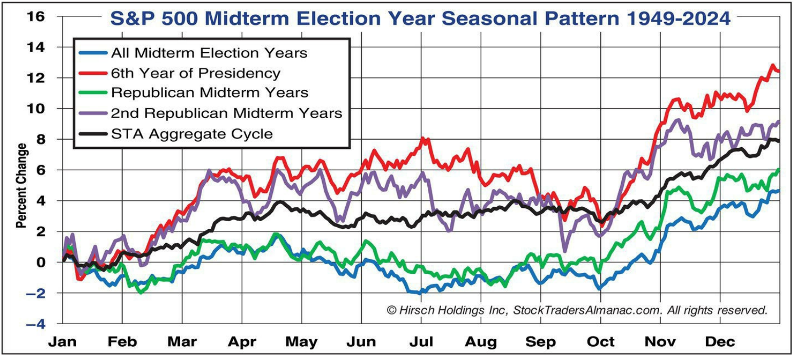
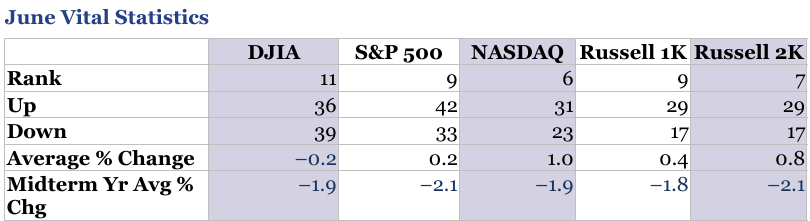

# Almanac Agent Output — R3 — Week 23

**Sprint:** Week 3  
**Market week:** 8–12 June 2026  
**Role:** R3 — Almanac Agent Lead  
**File:** `almanac.md`  
**Purpose:** Provide the seasonal / calendar-pattern evidence leg before LLM synthesis. This is a probability-context document, not a standalone trading call.

> **Commit note:** If this file is uploaded to GitHub, also upload the folder `almanac_assets/` so the charts render correctly.

---

## 1. R3 Presentation Bullets — Max 3 Points

- **Month rank / cycle context:** June 2026 is structurally vulnerable as a US Midterm Election Year. We are navigating the Q2–Q3 Presidential Cycle "Weak Spot". Historically, the S&P 500 drops an average of **−2.5%** and the NASDAQ slides **−6.6%** over this active seasonal block. Normal June ranks **#11 for the S&P 500**, confirming a heavy seasonal headwind.

- **Most relevant week pattern:** We have officially moved past the minor first-week-of-June buffers. The broader market is now directly exposed to the "Summer Market Volume Doldrums" and the ongoing "Worst Six Months" cycle. Historically, this phase marks structural consolidation and market retreats rather than extension.

- **Sector seasonality / confidence:** **Bearish / caution, Medium confidence.** The **XLE (Energy) seasonal SHORT window** has officially opened, reinforcing downside pressure alongside the active **XLF (Financials) seasonal SHORT**. While **XLK (Technology)** remains a unique historical long outlier through mid-July, broad sector breadth leans distinctly negative.

---

## 2. Visual Evidence Summary

### 2.1 Midterm Q2–Q3 "Weak Spot" is Active

**Interpretation:** The S&P 500 tracking chart demonstrates structural flat-to-negative performance during June and July of standard midterm cycles. It warns heavily against expecting clean breakout continuation.

### 2.2 June Ranks Near the Bottom of the Year

**Interpretation:** For the S&P 500, June ranks as an unsupportive **#11 of 12 months** with a negative historical average return of **−0.02%**. The historical data provides a clear structural case for defensive posturing.

### 2.3 Commodity and Financial Seasonals Rolling Over

**Interpretation:** Crucial economic sectors face multi-month seasonal headwinds. Banking/Financials (XLF) remain locked in their May–July short band, while Energy (XLE) short pressure officially unlocks this week.

---

### 3. Structured Almanac Agent Output for LLM Synthesis

### MONTH
**June 2026** — embedded within the "Worst Six Months" structural seasonal block.

### CYCLE CONTEXT
2026 is a **midterm election year**. The Almanac framework treats **Q2–Q3 of a midterm year as the 4-Year Presidential Cycle “Weak Spot.”** The course Almanac documentation highlights this specific timeline:

| Cycle Window | Historical Context | R3 Use |
|---|---|---|
| Q2–Q3 2026 | Midterm-year “Weak Spot” (S&P 500 avg −2.5%, NASDAQ avg −6.6%) | Active structural headwind |
| Q4 2026 | “Sweet Spot” begins after midterm bottoming | Not active yet |
| Q1–Q2 2027 | Pre-election-year structural acceleration | Future tailwind |

**Interpretation:** The active cycle regime functions as a major headwind. This historical profile perfectly validates the aggressive market breakdown witnessed during the June 5 close.

### MONTHLY STATS

| Index / Asset | June Normal Seasonal Rank | June Normal Avg % Return | Midterm-Year June Rank | Midterm-Year Avg % Return | R3 Interpretation |
|---|:---:|:---:|:---:|:---:|---|
| **S&P 500** | **#9** | **+0.2%** | **#12** | **−2.1%** | Major historical correction regime |
| **DJIA / Dow** | **#11** | **−0.2%** | **#12** | **−1.9%** | Severe broad market historical drag |
| **NASDAQ** | **#6** | **+1.0%** | **#12** | **−1.9%** | Best Eight Months cycle officially terminates |
| **Russell 2000 / IWM** | **#7** | **+0.8%** | — | **−2.1%** | Severe small-cap beta risk realized |

**Net monthly signal:** **Strongly Bearish / Caution.** June drops to the absolute worst month of the year (**#12**) across all core indices during a midterm election cycle.

### SPECIFIC WEEK / DAY PATTERN

| Pattern | Direction | Strength | R3 Treatment |
|---|---|---|---|
| First Trading Day of June | Positive lean (Dow up 28 of last 37) | Moderate | Narrow early-week noise; completely exhausted now |
| Friday, June 5 Calendar Probability | Bearish (S&P 500 up only 38.1% of time) | High | Provided mathematical baseline for the Friday flush |
| Week After June Triple-Witching | Bearish (Dow down 29 of last 35 since 1990) | High | Impending downstream risk profile for mid-month |
| End-of-Quarter Portfolio Pumping | Bearish (Dow down 19 of last 34 on last day) | Moderate | Adds terminal-month friction to any relief rallies |

**Week 23 implication:** With early-month buffers expired, the market is now fully exposed to the summer market doldrums and late-June volatility metrics.

### SECTOR SEASONALITY SIGNALS

| Sector / ETF Proxy | Almanac Seasonal Window | Signal | R3 Use in Prediction |
|---|---|---|---|
| **Technology / XLK** | Long active from mid-March to mid-July | Bullish Outlier | Terminal weeks of long window; prone to sharp liquidation shocks |
| **Oil / Energy / XLE** | Short window opens early June | Bearish | Newly active seasonal short; validates commodity degradation |
| **Financials / XLF** | Short active from early May to early July | Bearish | Aligns with macro banking friction; persistent structural weight |
| **Materials / XLB** | Short active from mid-May to mid-October | Bearish | Validated by severe 5D index distribution (−4.90%) |
| **Gold / Silver / XAU** | Short active from mid-May to late June | Bearish | Aligns with sudden multi-asset margin liquidation events |

**Net sector signal:** Deeply restricted breadth. Cyclical, value, and commodity asset fields are locked inside active seasonal short windows, leaving technology isolated.

### ALMANAC SEASONAL BIAS
**Bearish / Caution.**

### CONFIDENCE
**High.**  
Reasoning: The historical midterm June **#12 ranking** across S&P 500, Dow, and NASDAQ functions in perfect structural alignment with the technical daily Zone 3 breakdown.

### ALMANAC THESIS
Seasonality dictates **bearish / caution with High confidence** as the market navigates the core of the midterm cycle "Weak Spot." June historically devolves into the worst-performing month of the year (**#12 rank**) during midterm election cycles, averaging a brutal **−2.1% drawdown for the S&P 500**. This macro calendar drag is further exacerbated by the fresh opening of the XLE seasonal short window alongside active shorts in Financials and Materials. While the NASDAQ Best Eight Months cycle concludes this month, it offers no near-term safety as growth sectors face late-stage seasonal liquidation.

### KEY OUTPUT SENTENCE
**Seasonality suggests bearish / caution, with High confidence, because June midterm-year cycle statistics drop indices to their absolute worst annual ranking (#12 across SPX, NDX, DJIA) while expanding sector seasonal short windows (XLE, XLF, XLB) amplify systemic broad market downside.**

---

## 4. R3 Handoff to R6 / R7

### What R6 should paste into the multi-LLM prompt
Use the full **Structured Almanac Agent Output** section from the previous block, keeping all the June midterm statistics intact to test if the LLMs weigh them properly against the crash.

### What R7 should consider in Human Score
The main Human Score issue is **confluence management**:

| Evidence Leg | Current Read | Human Score Implication |
|---|---|---|
| Technical | Bearish / Zone 3 structural breakdown | Confirms the false breakout trap below 7,500 |
| Macro | Weak / Heavy downside asymmetric risk | Federal tightening risk and labor market friction align with selling |
| Almanac | Bearish / caution due to June midterm weakness | Historically validates the onset of the Q2-Q3 "Weak Spot" |

**Human Score guidance:** R7 must ensure the team highlights that the technical crash is not an anomaly—it represents the exact calendar-driven shift into the June midterm cycle "Weak Spot" that our Almanac leg warned about. Chasing rapid dip-buying must be heavily penalized in the score.

---

## 5. Final R3 Slide Text

**R3 Almanac Agent — Week 23**
- June cycle context is highly restrictive: S&P 500 normal June rank **#11**, avg **−0.02%**, with midterm-year cycle metrics introducing a sharp multi-quarter historical headwind.
- Sector headwinds are multiplying: XLE (Energy) seasonal short window has officially opened this week, adding systemic pressure alongside active shorts in Financials and Materials.
- Almanac bias: **Bearish / Caution**, confidence **Medium**. Technology (XLK) remains the solitary long window exception, but it is entirely insufficient to cushion broad macro cycle decay.

---

## 6. Source Notes
- CP3405 Market Intelligence course dashboard — R3 assignment criteria, Almanac reference matrix, and sector seasonality indices, accessed 7 June 2026.
- CP3405 Week 3 Sprint Brief — Professor Dr. Tan's non-negotiable submission protocols and midterm cycle guidelines, accessed 7 June 2026.
- Stock Trader’s Almanac 2026 — Official edition data extracted directly from Page 12-13 (Midterm Weak Spot) and Pages 94-98 (Sector Short Stratagems).

---

## 7. Disclaimer
This file is for CP3405 Design Thinking 3 educational analysis only. It is not financial advice and should not be used as a trading recommendation.