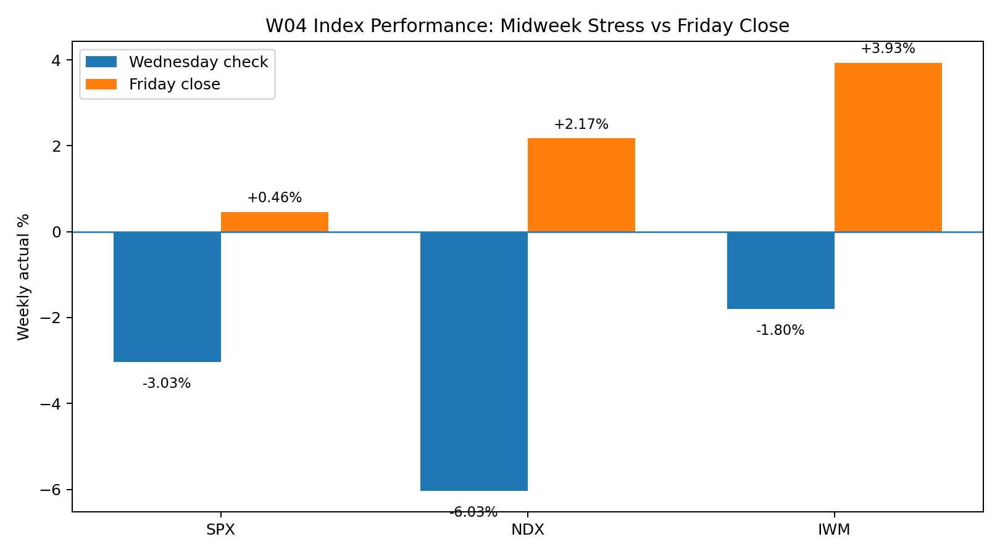
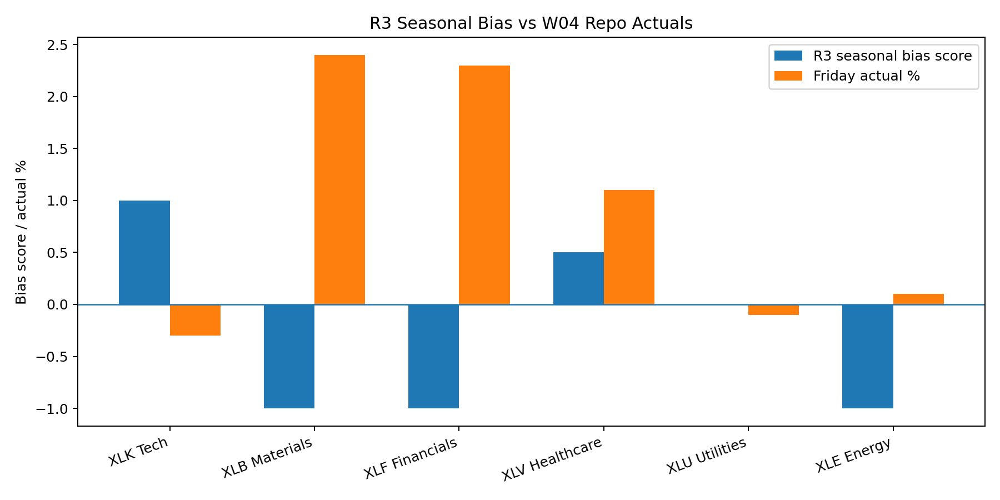

# Week 4 — R3 Almanac Agent Output (Repo-Aligned)

**Role:** R3 — Almanac Agent  
**Sprint:** W04 / vW24  
**Forecast window:** 15–19 June 2026  
**Purpose:** Rewrite the previous R3 file so it matches the Week4 GitHub evidence instead of standing alone as a bearish seasonal forecast.

---

## 1. Required R3 responsibility

R3 must provide **seasonal patterns, historical analogues, and calendar-based signals** before the LLM stage. For W04, the relevant calendar risks were:

- June seasonal weakness and midterm-year caution.
- FOMC meeting on 16–17 June 2026, marked as a Summary of Economic Projections meeting.
- Juneteenth market holiday on Friday 19 June 2026, compressing trading activity into a four-session week.
- Quarterly options-expiry pressure around the same window.

The corrected R3 conclusion is not that Almanac was useless. The corrected conclusion is that Almanac correctly warned about **instability**, but did not correctly predict the final direction.

---

## 2. R3 corrected summary call

| Item | Previous R3 draft | Repo-aligned R3 correction |
|---|---|---|
| Broad market bias | Bearish-neutral | **Volatile first, then neutral-bullish recovery** |
| Best index | NDX relative strength | **IWM strongest, NDX second, SPX mild positive** |
| Weakest index | IWM | **SPX was weakest of the three primary indices, not IWM** |
| Leading sector | XLK Technology | **XLB Materials and XLF Financials led** |
| Lagging sector | XLE/XLF/XLB | **XLC lagged most; XLK also underperformed** |
| Confidence | Medium | **Medium, but for a different reason: evidence conflict, not pure seasonal conviction** |

**Corrected R3 bias:** **Calendar-risk warning + medium-confidence risk-on recovery after evidence confirmation.**

---

## 3. Calendar pattern analysis

The Almanac signal still mattered because W04 was not a clean bullish week. The Wednesday evidence confirms this: SPX was −3.03%, NDX −6.03%, IWM −1.80%, VIX +12.46%, Technology −7.70%, and Gold −6.09%. That is exactly the kind of instability R3 should warn about.

However, by the Friday close, the uploaded actuals show a full reversal: SPX +0.46%, NDX +2.17%, IWM +3.93%, VIX −6.25%, BTC +5.20%, and WTI −6.25%.

**R3 interpretation:** Almanac identified the risk window, but live evidence showed that the risk window was absorbed and reversed. Therefore R3 should reduce directional certainty and feed R1 a **confidence adjustment**, not a hard bearish call.

---

## 4. Sector seasonality versus actual repo evidence

| Sector | Initial Almanac bias | Friday closing evidence | Corrected R3 interpretation |
|---|---|---:|---|
| XLK Technology | Positive seasonal candidate | −0.30% | Seasonal support failed to translate into leadership; do not name XLK as leader. |
| XLB Materials | Negative seasonal candidate | +2.40% | Actual evidence overrides the seasonal expectation. Materials became the closing leader. |
| XLF Financials | Negative / rate-sensitive | +2.30% | FOMC risk did not stop Financials from leading; previous bearish sector call must be changed. |
| XLV Healthcare | Defensive / neutral-positive | +1.10% | Defensive strength was valid and matched the repo's pipeline coverage. |
| XLU Utilities | Neutral / yield-sensitive | −0.10% | Mild underperformance; not a leader. |
| XLE Energy | Negative / volatile | +0.10% | Energy was not a disaster by Friday, but crude oil weakness kept it from leadership. |
| XLC Communications | Not central in previous draft | −1.90% | Should be added as the clearest lagging sector from repo evidence. |

**Minimum sector requirement met:** The updated R3 output explicitly covers more than three sectors, with final emphasis on **XLB, XLF, XLV, XLK, XLE, XLU, and XLC**.

---

## 5. Historical-pattern conclusion

The historical/calendar pattern should be written as a **two-stage week**:

| Stage | Evidence | Almanac reading |
|---|---|---|
| Midweek stress | SPX −3.03%, NDX −6.03%, VIX +12.46%, XLK −7.70% | Calendar risk was real. FOMC/holiday/expiry week increased volatility. |
| Friday recovery | SPX +0.46%, NDX +2.17%, IWM +3.93%, VIX −6.25% | Seasonal weakness did not persist; breadth and small-cap recovery overruled the bearish seasonal filter. |

**R3 final judgement:** W04 should be described as **volatile but ultimately risk-on**, not simply bearish-neutral.

---

## 6. R3 input to R1 final call

| Area | R3 repo-aligned signal | Impact on final R1 call |
|---|---|---|
| SPX | Mild positive, weakest of primary indices | Call **Up/Flat**, not Down. |
| NDX | Positive recovery, but Tech sector lagged | Call **Up**, but avoid saying Tech was the main sector leader. |
| IWM | Strongest primary index | Call **Up / Outperform**. Remove “IWM vulnerable”. |
| Leading sectors | XLB and XLF | Use **Materials and Financials** as leadership evidence. |
| Defensive support | XLV and XLP | Shows breadth was not only speculative risk-on. |
| Lagging sectors | XLC and XLK | Do not claim XLK was the best sector. |
| Confidence | Medium | R3 seasonal risk conflicted with final actuals, so confidence should not be High. |

---

## 7. Updated R3 presentation bullets

- Almanac risk was valid for the midweek drawdown: FOMC/SEP, Juneteenth closure, and options-expiry compression created a high-volatility window.
- Friday evidence overruled the bearish seasonal direction: SPX finished +0.46%, NDX +2.17%, and IWM led at +3.93%.
- Sector leadership must be corrected from XLK to **Materials and Financials**, while Communication Services and Technology were the main laggards.

---

## 8. R3 presentation script

My updated Almanac conclusion is that the calendar signal worked as a volatility warning, not as a final directional forecast. The midweek evidence supports the warning because volatility spiked and Technology fell hard. But the Friday closing evidence shows that the market absorbed the risk window and recovered. Therefore I would feed R1 a medium-confidence risk-on recovery call: SPX mildly positive, NDX positive, and IWM the strongest index. I would also correct the sector call: Materials and Financials led, while Communication Services and Technology lagged. This means the Almanac signal should reduce confidence, but it should not override the repo's final technical and actuals evidence.

---

## 9. R3 invalidation and learning note

The earlier R3 bearish-neutral call would have been valid only if VIX stayed elevated, SPX/NDX failed to recover, IWM lagged, and Technology weakness spread into all cyclical sectors. The actual repo evidence shows the opposite by Friday.

**Learning for W05:** R3 should separate **calendar risk** from **directional prediction**. A high-risk week can still close positive if technical structure remains bullish and money rotates into new leadership groups.

---

## Repo evidence sources checked

- Week4 folder: https://github.com/Gong-yinxuan/CP3405/tree/main/Week4
- W04 Wednesday Midsprint Check: https://github.com/Gong-yinxuan/CP3405/tree/main/Week4/Evidence/W04%20Wednesday%20Midsprint%20Check
- W04 Friday Closing: https://github.com/Gong-yinxuan/CP3405/tree/main/Week4/Evidence/W04%20Friday%20Closing
- Midweek actuals: https://raw.githubusercontent.com/Gong-yinxuan/CP3405/main/Week4/Evidence/actuals_2026-W04-midweek-log.md
- Closing actuals: https://raw.githubusercontent.com/Gong-yinxuan/CP3405/main/Week4/Evidence/actuals_2026-W04-closing.md
- Technical Agent W04: https://raw.githubusercontent.com/Gong-yinxuan/CP3405/main/Week4/R5_technical/technical_agent_W04.md
- Market Data Collector report: https://raw.githubusercontent.com/Gong-yinxuan/CP3405/main/Week4/w3_delta_report.md
- Course roadmap: https://dt3-tr2-26-market-intelligence.pages.dev/roadmap/
- Roles page: https://dt3-tr2-26-market-intelligence.pages.dev/roles/
- Federal Reserve 2026 FOMC calendar: https://www.federalreserve.gov/monetarypolicy/fomccalendars.htm
- NYSE holiday calendar: https://www.nyse.com/trade/hours-calendars
