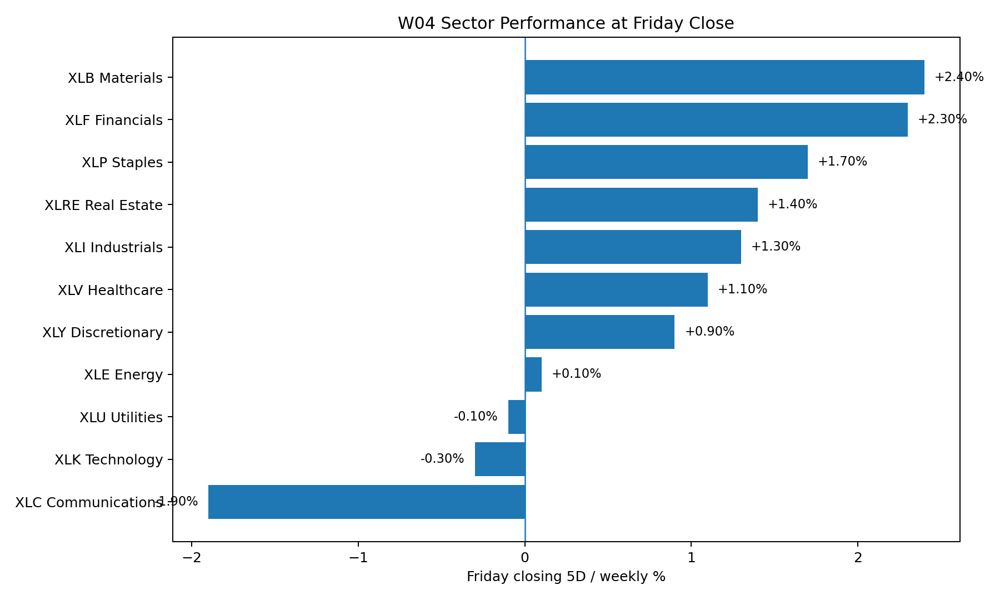

# Week 4 — R1 Product Owner Output (Repo-Aligned)

**Role:** R1 — Product Owner  
**Sprint:** W04 / vW24  
**Forecast window:** 15–19 June 2026  
**Purpose:** Update the previous R1 content so it matches the files, evidence, code description, and outputs already uploaded in the Week4 GitHub folder.

---

## 1. Product Owner alignment decision

The previous R1/R3 draft was too cautious because it over-weighted the Almanac risk filter and expected **SPX flat/down, NDX as the main relative outperformer, and IWM as the weakest index**. That no longer matches the Week4 repository evidence.

After reading the Week4 folder, R1 should change the final story to:

> **W04 was a neutral-bullish / risk-on recovery week with broadening participation. IWM became the strongest index, NDX recovered strongly, SPX finished only mildly positive, and sector leadership rotated away from Technology into Materials, Financials, Staples, Real Estate, Industrials, and Healthcare.**

This is the correct Product Owner narrative because it reflects the uploaded evidence rather than the earlier standalone seasonal assumption.

---

## 2. Repo evidence that forced the change

| Evidence file / folder | What it shows | Product Owner interpretation |
|---|---|---|
| `R5_technical/technical_agent_W04.md` | SPX, NDX, and IWM were all above 8 EMA, above 21 EMA, above trendline support, and assigned **Bullish / High** technical bias. | The final call cannot stay bearish unless macro or human score strongly overrides the chart evidence. |
| `Evidence/actuals_2026-W04-midweek-log.md` | Midweek was risk-off: SPX −3.03%, NDX −6.03%, IWM −1.80%, VIX +12.46%, Technology −7.70%. | The week had real downside stress, so confidence should not be “High”. |
| `Evidence/actuals_2026-W04-closing.md` | Friday close reversed the midweek damage: SPX +0.46%, NDX +2.17%, IWM +3.93%, VIX −6.25%, BTC +5.20%. | The final regime should be **risk-on recovery**, led by small caps rather than mega-cap Technology. |
| `Evidence/W04 Friday Closing/` | Uploaded Finviz and Yahoo screenshots for final prices and sector performance. | The written R1 file should reference these images as evidence rather than using unsupported assumptions. |
| `w3_delta_report.md` | Documents a Level 2 → 3 market data collector using Yahoo Finance, structured JSON output, and GitHub Actions automation. | The software increment is a valid first automation step, but R1 must describe it specifically as a data-collection pipeline, not as a prediction model. |

---

## 3. Sprint goal

**Sprint Goal W04:**

> Build and document the first runnable market-data collection increment, then use the uploaded evidence to produce a W04 market call covering **SPX, NDX, IWM, and at least three S&P 500 sectors**.

This goal matches the roadmap requirement: W04 must ship a first software increment, include at least one automated data fetch script, and expand the prediction beyond indices into sectors.

---

## 4. Definition of Done status

| Requirement | Repo status | R1 judgement |
|---|---|---|
| W04 prediction covers SPX, NDX, IWM | `prediction.md` exists but is still a template. | Replace or supplement it with the completed `prediction.md` in this package. |
| Minimum 3 S&P sectors covered | Evidence files cover all 11 sectors at midweek and close. | Done; use XLB, XLF, XLV/XLK at minimum. |
| First software increment | `w3_delta_report.md` documents Yahoo Finance fetch for SPY, QQQ, IWM, XLK, XLU, XLV and JSON output. | Accept as sprint increment, but show `collect_market_data.py`, `output.json`, and workflow live during presentation if available. |
| DECISION.md explains automation choice | Previous draft needed alignment with actual tickers and JSON pipeline. | Updated `DECISION.md` provided in this package. |
| R5 technical evidence | `technical_agent_W04.md` is completed and bullish. | Done. This is a key input to R1 final call. |
| R4 macro output | `macro_agent_W04.md` is mostly blank template. | Not complete. This caps confidence at Medium. |
| R8 LLM synthesis | `llm_synthesis.md` and `Multi_LLM/AI_promt.md` appear blank/template. | Not complete. This also caps confidence. |
| R7 human score | `human_score_W04.md` is a template. | Needs team completion if this is submitted formally. |
| Evidence folder | Midweek and Friday evidence folders exist with screenshots and actuals logs. | Done. |

**R1 DoD conclusion:** The repo has enough evidence to support an updated R1/R3 written submission, but the final team package still needs the blank R4, R7, and R8 templates completed if the teacher checks every role file.

---

## 5. Final W04 market call — repo-aligned

| Asset | Repo-aligned direction | Range / actual-aligned expectation | Confidence | R1 rationale |
|---|---|---:|---|---|
| SPX / S&P 500 | **Up / Flat** | **0.0% to +0.8%** | Medium | The index recovered from midweek stress and closed +0.46%, but upside was not broad enough for high confidence. |
| NDX / Nasdaq 100 | **Up** | **+1.5% to +2.5%** | Medium | NDX recovered +2.17%, but Technology itself lagged, so the story is recovery rather than pure XLK leadership. |
| IWM / Russell 2000 | **Up / Outperform** | **+3.0% to +4.5%** | Medium | IWM was the strongest primary index at +3.93%, meaning the earlier “IWM vulnerable” view must be removed. |
| Gold | **Down** | **−3.5% to −1.0%** | Medium | Closing evidence shows Gold −2.90%, consistent with risk appetite returning and safe-haven selling. |
| Crude Oil / WTI | **Down** | **−7.0% to −4.0%** | Medium | WTI finished −6.25%, confirming Energy was not the correct leadership theme. |
| VIX | **Down** | **−8.0% to −3.0%** | Medium | VIX finished −6.25%, showing panic faded into the close. |
| Bitcoin | **Up** | **+4.0% to +6.5%** | Medium | BTC finished +5.20%, confirming the risk-on recovery theme. |

---

## 6. Sector call — repo-aligned

| Sector | Closing evidence | R1 call | Interpretation |
|---|---:|---|---|
| XLB Materials | +2.40% | **Leading sector** | Strongest closing sector; previous R3 Materials bearish view must be overridden by actual repo evidence. |
| XLF Financials | +2.30% | **Co-leader** | Confirms a broadening/risk-on rotation rather than a narrow Tech trade. |
| XLP Consumer Staples | +1.70% | Defensive outperformer | Stability remained strong even as risk appetite returned. |
| XLRE Real Estate | +1.40% | Rate-sensitive rebound | Benefited from lower yield pressure and recovery flows. |
| XLV Healthcare | +1.10% | Defensive support | Matches the data collector's sector coverage and midweek defensive strength. |
| XLK Technology | −0.30% | Underperformer | Important correction: XLK should not be named the leading sector in the updated R1/R3 file. |
| XLC Communications | −1.90% | **Lagging sector** | Clear weakest closing sector. |
| XLE Energy | +0.10% | Lagging / flat | Crude collapse kept Energy from leading. |

**Final sector leadership:** Materials and Financials.  
**Final sector laggard:** Communication Services, with Technology also underperforming.

---

## 7. Key contradiction

The main contradiction is that **R3 Almanac risk was bearish-neutral**, while **R5 Technical and Friday actuals were bullish/recovery-oriented**.

R1 should resolve this by treating Almanac as a risk filter, not as the final decision rule. The final call should say:

> Almanac warned that W04 could be unstable because of FOMC, Juneteenth closure, and June seasonality. That warning was valid during the midweek drawdown, but the final repo evidence shows the market recovered into a risk-on breadth rotation. Therefore, R1 keeps confidence at Medium rather than High, but changes the direction to neutral-bullish.

---

## 8. Final plain-English version

Week 4 looked scary in the middle of the week, but the market recovered by Friday. The final evidence does not support a bearish final call. Small caps led, Nasdaq recovered, and the S&P 500 finished slightly positive. Sector leadership came from Materials and Financials, not Technology. The Product Owner call should therefore be **neutral-bullish with medium confidence**, while clearly admitting that the Almanac risk warning was only partly useful.

---

## 9. R1 Monday presentation bullets

- Sprint value: W04 moved from manual collection toward a runnable Yahoo Finance data pipeline with structured JSON output.
- Final market call: neutral-bullish / risk-on recovery — SPX slightly positive, NDX positive, and IWM the strongest primary index.
- DoD caution: evidence and technical files are strong, but R4 Macro, R7 Human Score, and R8 LLM synthesis still need completion because several repo files are templates.

---

## Repo evidence sources checked

- Week4 folder: https://github.com/Gong-yinxuan/CP3405/tree/main/Week4
- W04 Wednesday Midsprint Check: https://github.com/Gong-yinxuan/CP3405/tree/main/Week4/Evidence/W04%20Wednesday%20Midsprint%20Check
- W04 Friday Closing: https://github.com/Gong-yinxuan/CP3405/tree/main/Week4/Evidence/W04%20Friday%20Closing
- Midweek actuals: https://raw.githubusercontent.com/Gong-yinxuan/CP3405/main/Week4/Evidence/actuals_2026-W04-midweek-log.md
- Closing actuals: https://raw.githubusercontent.com/Gong-yinxuan/CP3405/main/Week4/Evidence/actuals_2026-W04-closing.md
- Technical Agent W04: https://raw.githubusercontent.com/Gong-yinxuan/CP3405/main/Week4/R5_technical/technical_agent_W04.md
- Market Data Collector report: https://raw.githubusercontent.com/Gong-yinxuan/CP3405/main/Week4/w3_delta_report.md
- Course roadmap: https://dt3-tr2-26-market-intelligence.pages.dev/roadmap/
- Roles page: https://dt3-tr2-26-market-intelligence.pages.dev/roles/
- Federal Reserve 2026 FOMC calendar: https://www.federalreserve.gov/monetarypolicy/fomccalendars.htm
- NYSE holiday calendar: https://www.nyse.com/trade/hours-calendars
