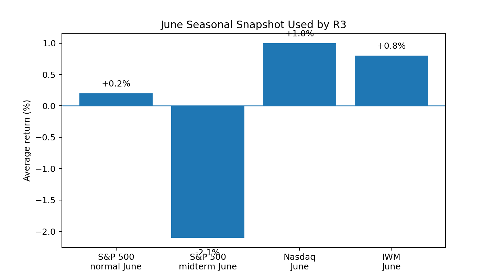
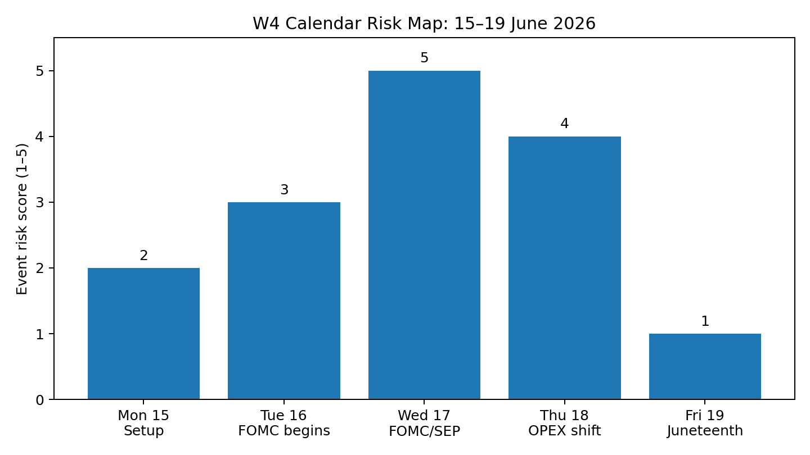
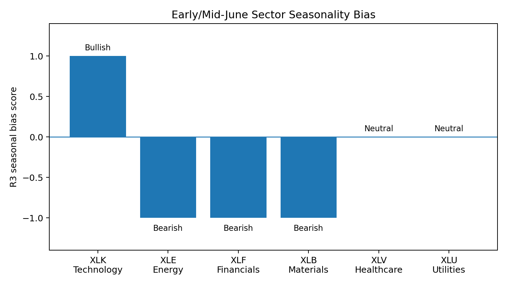

# Week 4 — R3 Almanac Agent Output

**Role:** R3 — Almanac Agent  
**Sprint week:** W4 / vW24  
**Prediction window:** Week of 15–19 June 2026  
**Prepared before LLM synthesis:** Yes  
**Purpose:** Provide the historical, seasonal, and calendar-based signal for the team prediction.

---

## 1. Required R3 responsibility

R3 is responsible for pulling **seasonal patterns, historical analogues, and calendar-based signals** before the team queries LLMs. The output must help the team decide whether the weekly prediction should lean bullish, neutral, or bearish.

For Week 4, the key question is:

> Does the mid-June calendar support chasing the recent index strength, or does it warn that the team should reduce confidence because of FOMC, options expiry, and weak midterm-year seasonality?

---

## 2. Almanac summary call

**R3 seasonal bias:** **Bearish-neutral**  
**Confidence contribution:** **Medium**  
**Best-supported index view:** SPX cautious / NDX relatively stronger / IWM vulnerable  
**Best-supported sector view:** Technology can still outperform, while Energy, Financials, and Materials carry negative seasonal risk.

My Almanac conclusion is not a full market prediction by itself. It is a risk filter. The seasonal evidence says the team should avoid an aggressive bullish call unless R4 Macro and R5 Technical show unusually strong confirmation.

---

## 3. June month rank and midterm-year context

June is not a strong month in the Almanac framework. The course Almanac example records June as a weak first-half month, with the S&P 500 ranked around the lower part of the monthly table and midterm-year June materially weaker than normal June.

| Market | June seasonal reading | R3 interpretation |
|---|---:|---|
| S&P 500 | Normal June average around **+0.2%** | Barely positive in ordinary years; not a strong bullish edge. |
| S&P 500 in midterm year | Around **-2.1%** | This is the most important R3 warning for Week 4. |
| Nasdaq | Around **+1.0%** | Still better than S&P, but the Best 8 Months period has already ended. |
| IWM / Russell 2000 | Around **+0.8%** | Positive average, but small caps remain rate-sensitive around FOMC week. |

**Interpretation:**  
2026 is a midterm election year. The Almanac framework treats Q2–Q3 of a midterm year as a weak spot in the four-year cycle. That means R3 should not treat June strength as automatically durable. The correct role response is to reduce confidence in broad upside and look for narrower leadership.

---

## 4. Week pattern: 15–19 June 2026

This is not a normal trading week. Three calendar features matter:

| Date | Event / calendar condition | Market relevance |
|---|---|---|
| Mon 15 Jun | Positioning day before FOMC | Markets may reduce risk before the policy event. |
| Tue 16 Jun | FOMC meeting begins | Rate-sensitive sectors and small caps likely face caution. |
| Wed 17 Jun | FOMC decision, press conference, and SEP/dot-plot week | Main event risk. A hawkish hold can pressure equities. |
| Thu 18 Jun | Options-expiry adjustment because Friday is closed | Potential volatility and mechanical flow risk. |
| Fri 19 Jun | Juneteenth holiday; U.S. equity/options markets closed | Shortened week; lower liquidity before/after closure. |

**Key R3 observation:**  
The usual June triple-witching / options-expiry pattern is complicated in 2026 because Juneteenth falls on Friday 19 June and U.S. markets are closed. This pulls important positioning pressure into Thursday 18 June. That makes Thursday more important than a normal pre-holiday session.

---

## 5. Calendar-based signals

### FOMC / SEP risk

The Federal Reserve meeting on 16–17 June is attached to the Summary of Economic Projections. This matters because equity markets are not only reacting to the rate decision; they are reacting to the forward path. If the Fed signals sticky inflation or fewer cuts, the negative impact should hit small caps and rate-sensitive sectors first.

**R3 reading:** FOMC week reduces confidence in broad upside.

### Juneteenth market closure

U.S. equity and options markets are closed on Friday 19 June. A Friday closure compresses weekly risk into four sessions. That can distort volume and increase positioning pressure before the holiday.

**R3 reading:** Holiday-shortened week increases noise and reduces confidence.

### Options-expiry / triple-witching window

June is a quarterly options-expiry month. The course Almanac example specifically warns that the week after June triple-witching has historically been weak. The Week 4 prediction is positioned directly around this window, so R3 should flag it before LLMs are queried.

**R3 reading:** The team should not ignore expiry-related volatility risk.

---

## 6. Sector seasonality: minimum 3 S&P sectors covered

| Sector ETF | Sector | Seasonal signal | R3 call | Reason |
|---|---|---|---|---|
| XLK | Information Technology | Positive | **Flat / Up** | The course Almanac example keeps Technology in a seasonal long window through mid-July. This supports NDX relative strength. |
| XLE | Energy | Negative | **Down / Volatile** | Early June starts an Energy seasonal short window. Oil/geopolitical risk can create counter-trend spikes, but the seasonal base case is negative. |
| XLF | Financials | Negative | **Flat / Down** | Banking/Financials have a May–July seasonal short window in the course Almanac example. FOMC week adds rate-path uncertainty. |
| XLB | Materials | Negative | **Down** | Materials seasonal short window runs through the summer/autumn period in the course example. Global demand sensitivity remains a headwind. |
| XLV | Healthcare | Neutral / defensive | **Flat** | Not the strongest seasonal edge, but defensive quality can help if Fed risk hurts cyclicals. |
| XLU | Utilities | Neutral / defensive | **Flat / Up if yields fall** | Utilities may benefit if yields fall, but FOMC risk prevents high conviction. |

**Minimum sector requirement met:** XLK, XLE, XLF, and XLB are explicitly covered. Extra defensive sectors are included to help R1 describe the final team call.

---

## 7. R3 contribution to final prediction

R3 should feed the following into R1/R7:

| Area | R3 signal | Impact on final call |
|---|---|---|
| SPX | Bearish-neutral | Avoid a high-confidence bullish SPX call. |
| NDX | Neutral-positive | NDX can outperform SPX because Technology still has the best seasonal support. |
| IWM | Bearish-neutral | IWM is vulnerable because small caps are more rate-sensitive during FOMC week. |
| Sector leadership | XLK strongest seasonal candidate | If the team needs a leading sector, choose Technology. |
| Sector laggards | XLE, XLF, XLB | Energy, Financials, and Materials are the clearest R3 downside candidates. |
| Confidence | Medium | Seasonal/calendar evidence is strong enough to affect the call, but not enough to override live macro/technical evidence alone. |

---

## 8. Three Monday presentation bullet points

- June in a 2026 midterm-year context is a weak seasonal setup, so R3 reduces confidence in broad upside even if recent price action looks strong.
- Week 4 is calendar-heavy: FOMC/SEP on 17 June, options-expiry pressure shifted toward 18 June, and Juneteenth closure on 19 June compress market risk into four sessions.
- Sector seasonality favours XLK relative strength, but warns against XLE, XLF, and XLB; therefore R3 supports **NDX over SPX, and SPX over IWM**.

---

## 9. Presentation script for R3

My Almanac signal for Week 4 is bearish-neutral with medium confidence. The reason is not one single event, but the combination of June midterm-year weakness, the FOMC/SEP meeting on Wednesday, and the June options-expiry window being compressed by the Juneteenth market closure on Friday. Seasonally, I would not support a high-confidence bullish call on the broad market. I would allow relative strength in Technology because XLK remains the clearest positive seasonal sector, but I would flag Energy, Financials, and Materials as weaker seasonal areas. My contribution to the final call is: keep SPX cautious, let NDX be the relative outperformer, and treat IWM as the most vulnerable index.

---

## 10. Invalidation conditions for R3

R3 should soften the bearish-neutral signal if:

1. The FOMC statement and SEP are clearly dovish.
2. Bond yields fall after the Fed decision instead of rising.
3. XLK leadership broadens into non-tech sectors.
4. IWM breaks higher with confirmation from Financials and Industrials.

R3 should strengthen the bearish signal if:

1. The Fed signals sticky inflation or fewer future cuts.
2. Yields rise after the FOMC decision.
3. SPX/NDX strength is narrow while IWM lags.
4. XLF, XLE, and XLB all underperform together.

---

## Sources used

- CP3405 DT3 Roadmap: https://dt3-tr2-26-market-intelligence.pages.dev/roadmap/
- Sprint 4 Announcement: https://dt3-tr2-26-market-intelligence.pages.dev/sprint4/
- Roles & Responsibilities: https://dt3-tr2-26-market-intelligence.pages.dev/roles/
- System Architecture: https://dt3-tr2-26-market-intelligence.pages.dev/system/
- Exemplary Solution / Almanac example: https://dt3-tr2-26-market-intelligence.pages.dev/exemplary-solution
- Federal Reserve FOMC calendar: https://www.federalreserve.gov/monetarypolicy/fomccalendars.htm
- Federal Reserve June 2026 calendar: https://www.federalreserve.gov/newsevents/2026-june.htm
- Nasdaq 2026 U.S. equity/options holiday calendar: https://www.nasdaqtrader.com/trader.aspx?id=Calendar
- NYSE holiday calendar: https://www.nyse.com/trade/hours-calendars
- Cboe 2026 options expiration calendar: https://cdn.cboe.com/resources/options/Cboe2026OPTIONSCalendar.pdf
- Reuters macro context, 9–10 Jun 2026: Fed hold-rate expectation and persistent inflation risk.
