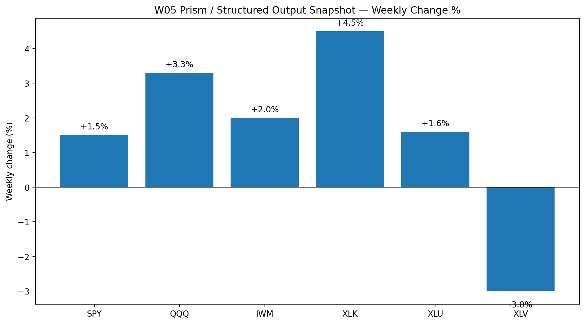
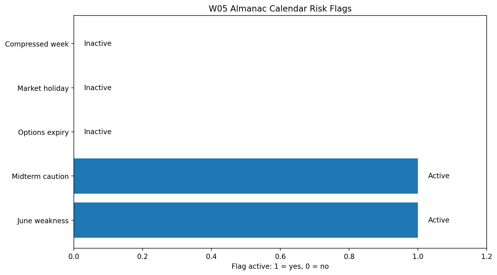
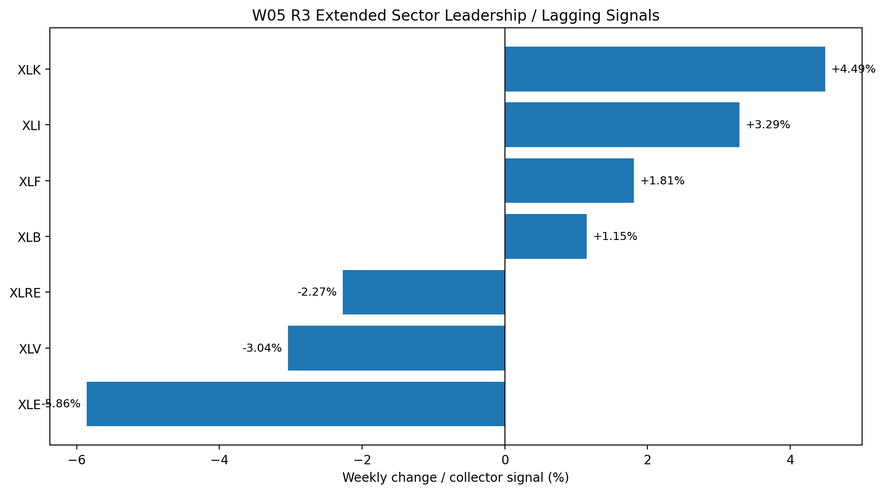

# Almanac Agent Output — R3 — Week W05

**Sprint:** Week W05 / vW25  
**Forecast market week:** 22 June 2026 – 26 June 2026  
**Role:** R3 — Almanac Agent  
**File target:** `Week5/R3_almanac/almanac_agent_W05.md`  
**Purpose:** Provide the seasonal, calendar-pattern, historical-analogue, and sector-seasonality evidence leg before R8 runs the multi-LLM synthesis. This is a probability-context document, not a standalone trading call.

> **Prism note:** The publicly committed repository does not expose a separate private Prism endpoint. I treated the committed `Week5/output.json` as the current structured Prism-style output available to the team, then cross-checked it against the existing R3 Almanac collector notes in `Week5/R3_almanac/almanac_agent_W05.md`.

---

## 1. R3 Presentation Bullets — Max 3 Points

- **Month rank / cycle context:** June 2026 remains a **seasonal caution window** because the active Almanac flags are **June seasonal weakness** and **midterm-year caution**. This does not force a bearish call, but it should cap confidence.
- **Most relevant week pattern:** W05 has **no options-expiry-week flag, no market-holiday flag, and no compressed-trading-week flag**. Calendar pressure is therefore lower than W04, but late-June seasonality still warns against overconfidence.
- **Sector seasonality / Prism confirmation:** Prism-style structured output is **mildly risk-on but mixed**: QQQ +3.3%, IWM +2.0%, SPY +1.5%, and XLK +4.5%, while XLV is -3.0%. Final R3 bias: **neutral-cautious / mildly risk-on, Medium confidence**.

---

## 2. Prism / Structured Output Extract

Source file used: `Week5/output.json`  
Data date: **2026-06-20**

| Asset / ETF | Close | Weekly change % | R3 read |
|---|---:|---:|---|
| SPY | 746.74 | +1.5% | Broad market positive but not explosive |
| QQQ | 740.62 | +3.3% | Growth / technology leadership confirmed |
| IWM | 295.59 | +2.0% | Small caps participated, but less than QQQ |
| XLK | 191.44 | +4.5% | Strongest committed sector signal |
| XLU | 44.76 | +1.6% | Defensive sector positive; not a pure risk-on tape |
| XLV | 149.40 | -3.0% | Defensive healthcare lag confirms mixed breadth |

**Interpretation:** The committed Prism-style data supports a **mildly risk-on** view because QQQ, IWM, SPY, XLK, and XLU are positive. The signal is not high-confidence bullish because XLV is materially negative and the dataset only covers six tickers, not all 11 S&P sectors.

---

## 3. Calendar and Seasonal Context

| Calendar / seasonal flag | Status | Directional implication | R3 treatment |
|---|---:|---|---|
| June seasonal weakness | Active | Bearish / cautious | Confidence reducer |
| Midterm-year caution | Active | Bearish / cautious | Confidence reducer |
| Options-expiry week | Not active | Neutral | No expiry-week penalty for W05 |
| Market-holiday week | Not active | Neutral | No holiday-compression penalty |
| Compressed trading week | Not active | Neutral | Calendar structure cleaner than W04 |

**Interpretation:** W05 is a cleaner calendar week than W04, but June and midterm-year seasonality remain active caution factors. Therefore R3 should not override bullish technical evidence automatically, but should prevent the team from assigning High confidence unless Macro, Technical, and Human Score all agree strongly.

---

## 4. Historical Analogue / Pattern Read

The best analogue is **not a single historical year**, because the current collector does not provide verified exact June average returns, monthly rank, or late-June day-by-day return tables. The safer historical-pattern read is therefore a **regime analogue**:

| Analogue component | Current W05 condition | R3 implication |
|---|---|---|
| Late June | Seasonal weakness flag active | Avoid high-confidence bullish language |
| US midterm year | Midterm-year caution active | Higher volatility / false-break risk |
| Post-expiry / post-holiday | Expiry and holiday flags not active in W05 | Lower calendar pressure than W04 |
| Growth-led tape | QQQ +3.3%, XLK +4.5% in Prism output | Supports mild risk-on leadership |
| Mixed defensive signal | XLU +1.6% but XLV -3.0% | Breadth is not cleanly bullish or defensive |

**Historical-pattern conclusion:** W05 should be treated as a **cautious continuation week**, not a high-conviction breakout week. The seasonal background is a headwind, but the current Prism output shows enough growth leadership to support a mild risk-on interpretation.

---

## 5. Sector Seasonality / Breadth Signal

The committed `output.json` directly confirms six assets only. The existing R3 collector notes also provide an extended sector ranking. To avoid overclaiming, the table below separates **committed Prism data** from **extended R3 collector notes**.

| Sector / ETF | Signal source | Weekly change / collector value | R3 interpretation |
|---|---|---:|---|
| Technology / XLK | Prism output + R3 collector | +4.5% / +4.49% | Clear leader; supports QQQ / NDX strength |
| Industrials / XLI | R3 collector notes | +3.29% | Positive cyclical participation, but raw JSON not committed |
| Financials / XLF | R3 collector notes | +1.81% | Mildly constructive breadth, raw JSON not committed |
| Materials / XLB | R3 collector notes | +1.15% | Positive but not leadership-grade |
| Utilities / XLU | Prism output | +1.6% | Defensive support; confirms mixed tape |
| Healthcare / XLV | Prism output + R3 collector | -3.0% / -3.04% | Weak defensive sector; breadth drag |
| Real Estate / XLRE | R3 collector notes | -2.27% | Rate-sensitive laggard, raw JSON not committed |
| Energy / XLE | R3 collector notes | -5.86% | Strong laggard despite macro oil risk |

**Net sector read:** Sector evidence is **mixed but slightly constructive**. Technology leadership is strong and supports NDX/QQQ. However, weak Healthcare, Energy, and Real Estate prevent a clean broad-market bullish call.

---

## 6. Alignment with Other Week5 Repo Evidence

| Evidence leg | Repo read | R3 integration |
|---|---|---|
| R4 Macro | Slightly Bearish; geopolitical risk, oil / safe-haven pressure, sticky inflation concern | R3 should not become aggressively bullish because macro adds downside tail risk |
| R5 Technical | SPX and NDX bullish with high confidence; IWM bullish with medium confidence | R3 should allow mild risk-on because price structure confirms leadership |
| Multi-LLM | Template incomplete at time reviewed | R3 must be ready as independent input before R8 synthesis |
| R7 Human Score | Template incomplete at time reviewed | R3 handoff should be concise and machine-readable |

**Synthesis for R8/R7:** Almanac does **not** deliver the strongest directional signal this week. It functions as a **confidence filter**: technical and Prism output are constructive, while June / midterm seasonality and macro risk argue against High confidence.

---

## 7. Structured Almanac Agent Output for LLM Synthesis

### MONTH

**June 2026** — a seasonal caution month within a US midterm-year context.

### CYCLE CONTEXT

2026 is treated as a **midterm-year caution regime** in the existing Almanac framework. June seasonal weakness remains active, but W05 does not have the extra W04 pressure from options expiry / holiday compression.

### MONTHLY STATS

| Index / Asset | June seasonal rank | June average return | Collector status | R3 treatment |
|---|---:|---:|---|---|
| S&P 500 / SPY | Not available | Not available | Not automated in current collector | Do not invent exact values |
| Nasdaq 100 / QQQ | Not available | Not available | Not automated in current collector | Use Prism QQQ and XLK leadership instead |
| Russell 2000 / IWM | Not available | Not available | Not automated in current collector | Use Prism IWM participation instead |

**Net monthly signal:** Neutral-cautious.

### SPECIFIC WEEK / DAY PATTERN

| Pattern | Direction | Strength | R3 use |
|---|---|---:|---|
| June seasonal weakness | Bearish / cautious | Medium | Reduce confidence |
| Midterm-year caution | Bearish / cautious | Medium | Reduce confidence |
| No options-expiry-week flag | Neutral | Low | Do not apply expiry penalty |
| No market-holiday flag | Neutral | Low | No compressed-week adjustment |
| Growth-led Prism output | Bullish / risk-on | Medium | Supports QQQ / XLK leadership |
| Mixed sector breadth | Mixed | Medium | Prevents High confidence |

### SECTOR SEASONALITY SIGNAL

- **Leading / supportive sectors:** Technology / XLK; extended collector also supports Industrials / XLI and Financials / XLF.
- **Lagging / warning sectors:** Healthcare / XLV; extended collector also warns on Energy / XLE and Real Estate / XLRE.
- **Defensive contradiction:** Utilities / XLU are positive while Healthcare / XLV is negative, so the tape is not a simple defensive rotation.

### ALMANAC SEASONAL BIAS

**Neutral-cautious / mildly risk-on.**

### CONFIDENCE

**Medium.**

Reasoning: The strongest live-style evidence is the Prism/structured output, which shows positive weekly change in SPY, QQQ, IWM, XLK, and XLU, with XLK as the strongest committed sector. However, June seasonal weakness, midterm-year caution, incomplete 11-sector coverage, XLV weakness, and R4's macro caution prevent a High-confidence bullish call.

### KEY OUTPUT SENTENCE

**Seasonality suggests neutral-cautious / mildly risk-on with Medium confidence: W05 has lower calendar pressure than W04, and Prism output confirms QQQ / XLK leadership, but June midterm-seasonal weakness and mixed sector breadth should reduce final prediction confidence.**

---

## 8. R3 Handoff to R8 / R7

### Paste this into the LLM synthesis prompt

R3 Almanac read for W05 / vW25: June seasonal weakness and midterm-year caution remain active, so seasonality is a confidence reducer. W05 has no options-expiry-week, market-holiday, or compressed-trading-week flag, so calendar pressure is lower than W04. Prism/structured output dated 2026-06-20 shows SPY +1.5%, QQQ +3.3%, IWM +2.0%, XLK +4.5%, XLU +1.6%, and XLV -3.0%. This supports a neutral-cautious / mildly risk-on read led by QQQ / XLK, but weak XLV and incomplete sector coverage prevent High confidence. Use Medium confidence and treat R3 as a caution filter, not a hard bearish override.

### Slide-ready text — 3 bullets only

**R3 Almanac Agent — Week W05**

- June seasonal weakness and midterm-year caution remain active; Almanac reduces confidence.
- W05 has no expiry-week, holiday, or compressed-week flag; calendar pressure is lower than W04.
- Prism output is mildly risk-on: QQQ +3.3%, IWM +2.0%, SPY +1.5%, XLK +4.5%, but XLV -3.0% keeps confidence at Medium.

---

## 9. References / Evidence Used

- Course Sprint 5 page: Sprint 5 requires committed agent outputs, LLM synthesis, automated fetch evidence, and `vW25` release tag.
- Course Roadmap: W5 requires SPX + NDX + IWM + minimum 5 sectors, at least two automated structured agent outputs, Delta Engine, and GitHub Actions workflow.
- Course System Architecture: Prism is described as the future intelligent system layer; current manual / structured outputs are part of building toward that tool.
- GitHub Week5 root: confirms current Week5 folders include Multi_LLM, R10, R1, R3, R4, R5, R7, and `output.json`.
- GitHub Week5/output.json: structured data source used for Prism-style market output.
- GitHub Week5/R3_almanac/almanac_agent_W05.md: existing collector notes used for calendar flags and extended sector notes.
- GitHub Week5/R4_macro/macro_agent_W05.md: macro bias cross-check.
- GitHub Week5/R5_technical/technical_agent_W05.md: technical bias cross-check.
