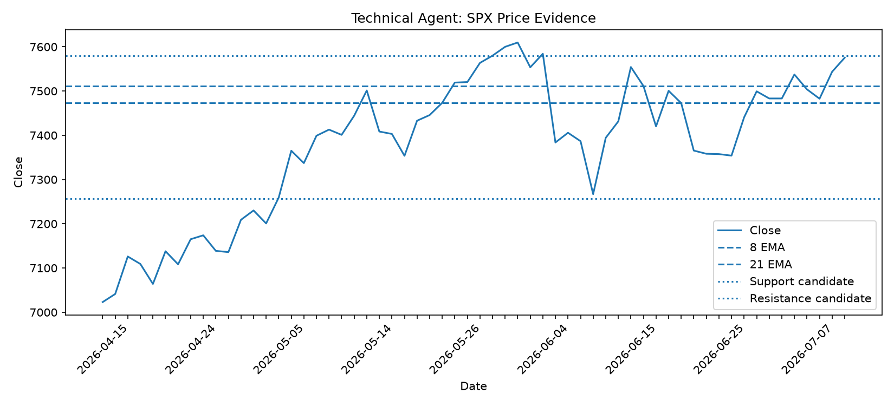
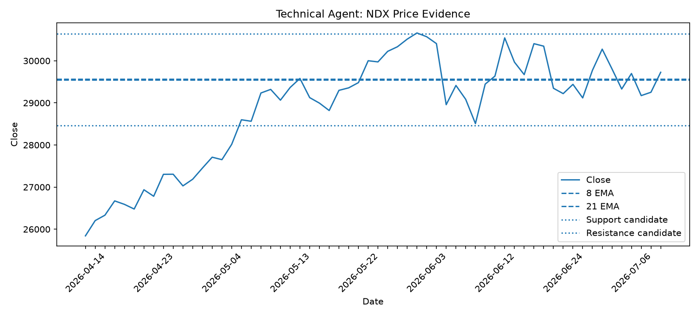
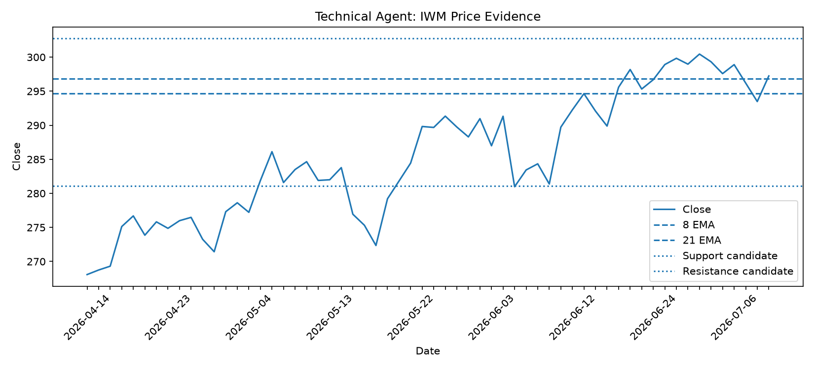
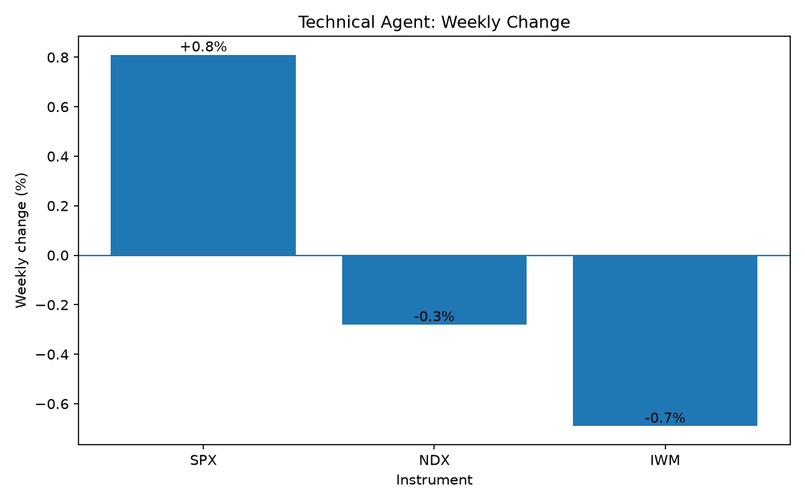

---

## 1. R5 Presentation Summary

- **SPX:** Neutral pullback with Medium-Low confidence. Price is below both EMAs, but the 8 EMA remains above the 21 EMA.
- **NDX:** Bearish with Medium-High confidence. Price is below both EMAs and the 8 EMA is below the 21 EMA.
- **IWM:** Neutral pullback with Medium-Low confidence. IWM shows better relative strength than SPX and NDX but remains below both EMAs.

**Overall technical bias:** Neutral-to-Bearish  
**Overall confidence:** Medium

---

## 2. Verified Technical Snapshot

| Instrument | Last Close | Weekly Change | 8 EMA | 21 EMA | EMA Condition | Bias | Confidence |
| --- | ---: | ---: | ---: | ---: | --- | --- | --- |
| SPX | 7,457.69 | -1.55% | 7,515.12 | 7,491.37 | Zone 2 Pullback | Neutral | Medium-Low |
| NDX | 28,592.66 | -4.13% | 29,236.69 | 29,427.65 | Zone 3 Bearish | Bearish | Medium-High |
| IWM | 294.04 | -0.66% | 295.29 | 294.75 | Zone 2 Pullback | Neutral | Medium-Low |

---

## 3. SPX Technical Read

SPX closed at **7,457.69**, down **1.55%** for the week.

Price is below the **8 EMA at 7,515.12** and the **21 EMA at 7,491.37**, showing weaker short-term momentum. However, the 8 EMA remains above the 21 EMA, so the EMA structure has not fully turned bearish.

The current classification is **Zone 2 Pullback**.

### Key Levels

- **20-day resistance candidate:** 7,581.50
- **20-day support candidate:** 7,294.18

### Technical Decision

- **Bias:** Neutral
- **Confidence:** Medium-Low
- A close above **7,581.50** would support a stronger bullish view.
- A close below **7,294.18** would shift the technical bias to bearish.
- Until either level breaks, SPX should be treated as a neutral pullback.

---

## 4. NDX Technical Read

NDX closed at **28,592.66**, down **4.13%** for the week.

Price is below the **8 EMA at 29,236.69** and the **21 EMA at 29,427.65**. The 8 EMA is also below the 21 EMA, confirming the weakest technical structure among the three indices.

The current classification is **Zone 3 Bearish**.

### Key Levels

- **20-day resistance candidate:** 30,642.57
- **20-day support candidate:** 28,231.32

### Technical Decision

- **Bias:** Bearish
- **Confidence:** Medium-High
- A close below **28,231.32** would confirm further bearish weakness.
- The technical outlook would improve if NDX recovered and held above the **29,236.69–29,427.65 EMA area**.
- A break above **30,642.57** would provide stronger bullish confirmation.

---

## 5. IWM Technical Read

IWM closed at **294.04**, down **0.66%** for the week.

Price is below the **8 EMA at 295.29** and the **21 EMA at 294.75**, showing mild short-term weakness. However, the 8 EMA remains slightly above the 21 EMA. IWM also declined less than SPX and NDX, indicating relative resilience.

The current classification is **Zone 2 Pullback**.

### Key Levels

- **20-day resistance candidate:** 302.72
- **20-day support candidate:** 290.68

### Technical Decision

- **Bias:** Neutral
- **Confidence:** Medium-Low
- A close above **302.72** would support a stronger bullish view.
- A close below **290.68** would shift the technical bias to bearish.
- Until either level breaks, IWM should be treated as a neutral pullback.

---

## 6. Relative Strength and Breadth Interpretation

All three tracked instruments recorded negative weekly returns:

- **SPX:** -1.55%
- **NDX:** -4.13%
- **IWM:** -0.66%

NDX significantly underperformed, indicating concentrated weakness in large-cap technology and growth stocks.

IWM recorded the smallest decline, showing better relative strength in small-cap stocks. However, because all three instruments finished negative, the overall technical picture remains cautious rather than broadly bullish.

---

## 7. R5 Final Handoff to R8

| Instrument | R5 Bias | Confidence | Main Technical Risk |
| --- | --- | --- | --- |
| SPX | Neutral | Medium-Low | Loss of 7,294.18 support |
| NDX | Bearish | Medium-High | Further weakness below 28,231.32 |
| IWM | Neutral | Medium-Low | Loss of 290.68 support |

**Net technical bias:** Neutral-to-Bearish  
**Net confidence:** Medium

### Key Output Sentence

**Technical evidence is Neutral-to-Bearish with Medium confidence. NDX is the main source of downside risk because it is below both EMAs with a bearish EMA structure, while SPX and IWM remain neutral pullbacks above their major 20-day support candidates.**

### R8 Usage

R8 should use NDX as the strongest bearish technical signal. SPX and IWM do not yet confirm a broad market breakdown, so the final prediction should avoid excessive bearish confidence unless Macro, Almanac, and Human Score evidence support the same direction.

---

## 8. Visual Evidence

### SPX Price, EMA and Support/Resistance Evidence

### NDX Price, EMA and Support/Resistance Evidence

### IWM Price, EMA and Support/Resistance Evidence

### Weekly Change Comparison

---

## 9. R5 Sign-Off

- [x] SPX snapshot reviewed
- [x] NDX snapshot reviewed
- [x] IWM snapshot reviewed
- [x] EMA trend indicators included
- [x] Support and resistance candidates included
- [x] Technical charts included under `technical_assets/`
- [x] Final bias and confidence documented
- [x] R8 handoff prepared
- [x] No unfinished placeholders remain
